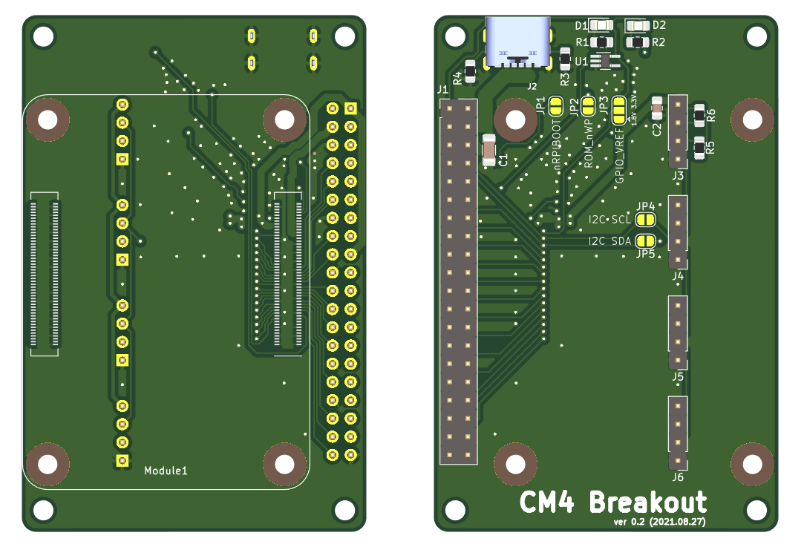
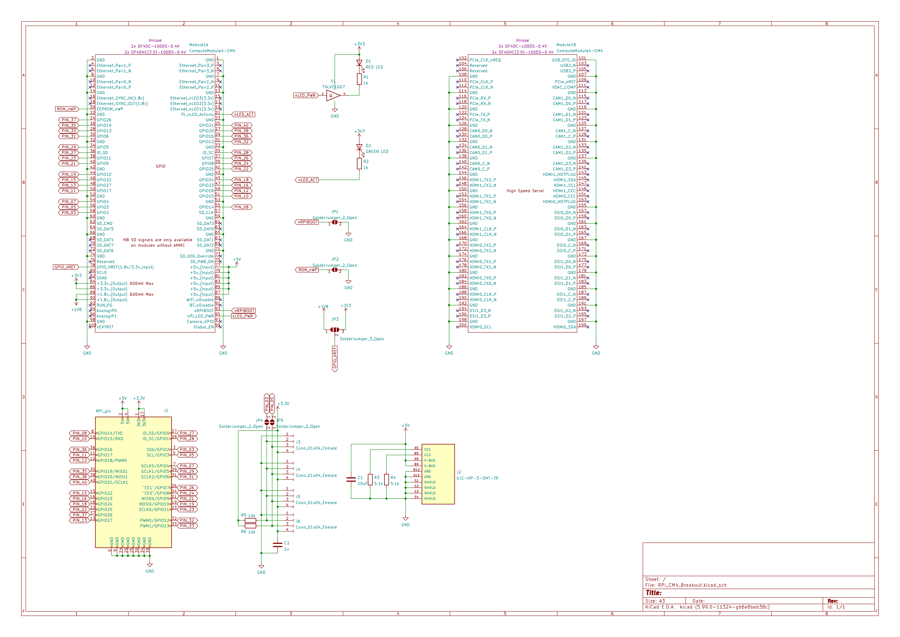

# RPi_CM4_Breakout

## 概要

Raspberry Pi Compute Module 4 から，通常の Raspberry Pi にあるピンヘッダを取り出す基板です．
サイズと穴位置は秋月のユニバーサル基板Ｃタイプに合わせてあります．

おまけで，I2C 用のピンヘッダ用のランドも設けています．

## 外観

## 回路図

## 基板の発注について

Raspberry Pi Compute Module 4 との接続に使う 100 ピンコネクタは手はんだが難しいので，この部分だけ基板メーカで実装してもらうのがおすすめです．

Elecrow にオーダーする際のシートを misc/Elecrow-PCBA-Quotation.xlsx においておきましたので参考にしてください．このファイルとガーバーデータを送れば製造できます．

料金は，私が製造したときは，送料込みで $168 でした．

